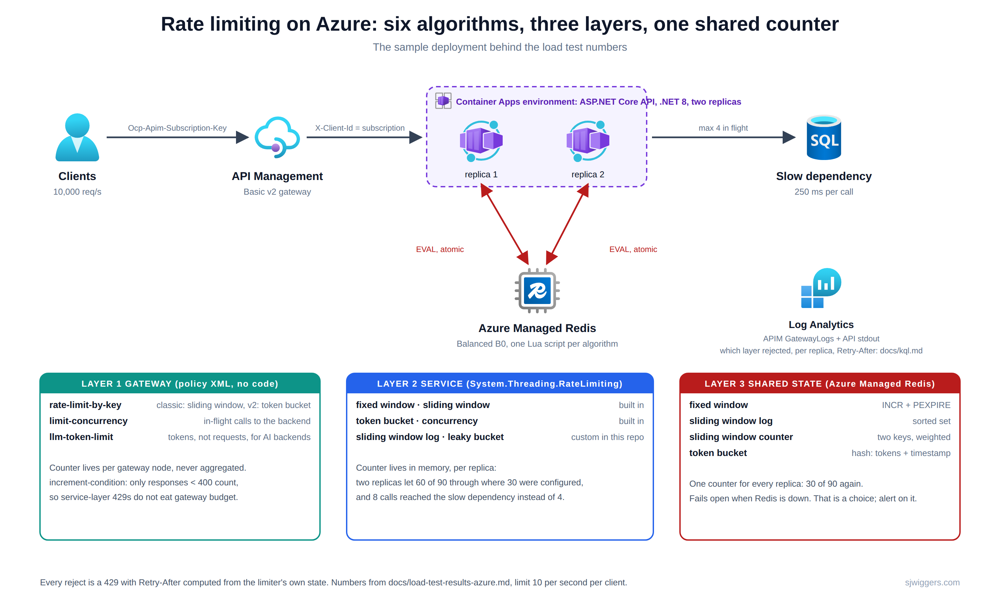
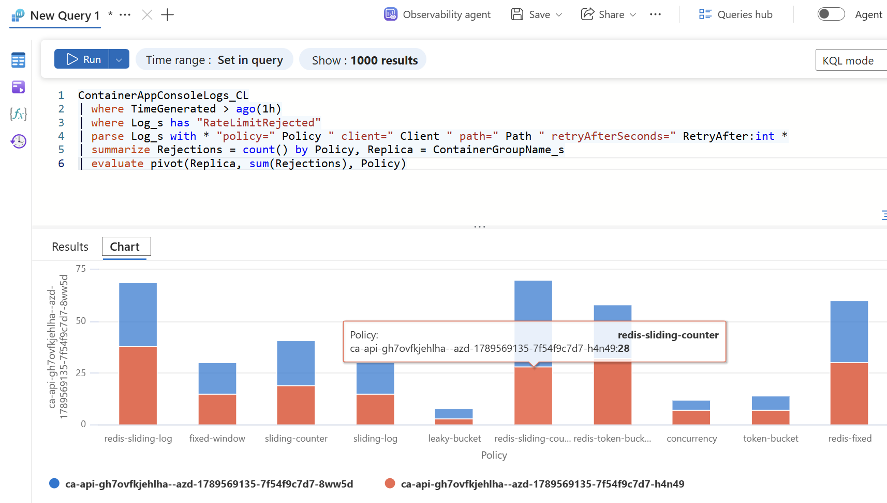

# rate-limiting-azure

Six rate limiting algorithms, implemented in C# on Azure, with a load test that shows what each one actually lets through.

Companion repo for the Cloud Perspectives post **"Six Rate Limiting Algorithms on Azure, and the Decisions That Come First"** ([blog-rate-limiting-six-algorithms-azure.md](blog-rate-limiting-six-algorithms-azure.md)).



## What is in here

| Algorithm | In-process (ASP.NET Core) | Distributed (Azure Managed Redis) | Gateway (APIM) |
|---|---|---|---|
| Fixed window counter | built in (`FixedWindowRateLimiter`) | Lua: `INCR` + `PEXPIRE` | |
| Sliding window log | custom [`SlidingWindowLogRateLimiter`](src/RateLimiting.Api/Limiters/SlidingWindowLogRateLimiter.cs) | Lua: sorted set | `rate-limit-by-key` on classic tiers |
| Sliding window counter | built in (`SlidingWindowRateLimiter`, segmented) | Lua: two counters, weighted | |
| Token bucket | built in (`TokenBucketRateLimiter`) | Lua: hash with tokens + timestamp | `rate-limit-by-key` on v2 tiers, `llm-token-limit` |
| Leaky bucket | custom [`LeakyBucketRateLimiter`](src/RateLimiting.Api/Limiters/LeakyBucketRateLimiter.cs) | | |
| Concurrency limiter | built in (`ConcurrencyLimiter`) | | `limit-concurrency` |

All Redis variants share one class, [`RedisRateLimiter`](src/RateLimiting.Api/Distributed/RedisRateLimiter.cs), which runs one atomic Lua script per algorithm.

Every limiter partitions on the `X-Client-Id` header (APIM sets it from the subscription id) and every rejection is a `429` with `Retry-After` and a problem-details body.

```
src/RateLimiting.Api        .NET 8 minimal API, one endpoint per algorithm
src/RateLimiting.LoadTest   console harness: boundary burst, sustained overload, concurrency
infra/                      azd + Bicep: Container Apps (2 replicas), Azure Managed Redis, APIM Basic v2
infra/apim/policies/        gateway-layer policies
docs/                       load-test-results*.md (local, 2 replicas + Redis, through APIM) and kql.md (Log Analytics queries)
```

## Run it locally

Requires the .NET 8 SDK.

```powershell
dotnet run --project src/RateLimiting.Api
# in a second terminal
dotnet run --project src/RateLimiting.LoadTest -- --base http://localhost:5080 --out results.md
```

Endpoints: `/api/fixed-window`, `/api/sliding-log`, `/api/sliding-counter`, `/api/token-bucket`, `/api/leaky-bucket`, `/api/concurrency`, plus `/api/unlimited` as the baseline. All limits are 10 requests per second (4 concurrent for the concurrency endpoint); change them in `appsettings.json` under `RateLimits`.

To try the distributed variants locally, point `ConnectionStrings:Redis` at any Redis (`docker run -p 6379:6379 redis` works) and add `--redis` to the load test. The `/api/redis/*` endpoints appear only when a connection string is set.

## What the load test shows

From `docs/load-test-results.md`, limit 10 per 1000 ms, single instance:

| Algorithm | Burst across boundary: max accepted in any 1 s | Sustained 3x overload: accepted of 90 | p95 latency under overload |
|---|---|---|---|
| fixed-window | **19** | 30 | 3 ms |
| sliding-log | 10 | 30 | 1 ms |
| sliding-counter | 10 | 26 | 1 ms |
| token-bucket | **18** | 39 | 1 ms |
| leaky-bucket | 11 | 40 | **1002 ms** |

And 20 simultaneous calls to a 250 ms backend: `/api/unlimited` lets all 20 hit it at once, `/api/concurrency` lets 4 through and rejects 16.

Same test against the deployed API on Container Apps with **two replicas** (`docs/load-test-results-azure.md`):

| Algorithm | In-process, 2 replicas: accepted of 90 | Redis-backed: accepted of 90 |
|---|---|---|
| fixed-window | **60** | 30 |
| sliding-log | **60** | 30 |
| sliding-counter | 40 | 29 |
| token-bucket | 77 | 39 |
| concurrency (20 simultaneous) | **8** reach the backend | n/a (4 configured) |

Every in-process limiter doubled because each replica counts on its own. Every Redis-backed limiter returned the single-instance numbers. That is the whole argument for the third column of this repo.

Through APIM (`docs/load-test-results-apim.md`, `--header "Ocp-Apim-Subscription-Key: ..."`) the numbers are the same within noise, the gateway adds 2 to 5 ms at p50, every response carries `X-Gateway: apim` with `client` set to the subscription id, and APIM itself rejected nothing: its `rate-limit-by-key` uses `increment-condition` to count only responses below 400, so the service layer's 429s never consumed gateway budget.

The token bucket number is not a bug in the test. Inside a `PartitionedRateLimiter` (which is how ASP.NET Core always hosts it), .NET's `TokenBucketRateLimiter` does not advance its replenishment timestamp while the bucket is full, so after an idle spell the next refill credits all the elapsed time at once. In practice the burst allowance is up to two buckets, not one. The Redis token bucket in this repo updates the timestamp on every call and does not have that behaviour. See the post for the source reference.

## Deploy to Azure

Requires [azd](https://aka.ms/azd) and an Azure subscription. No local Docker: `azure.yaml` sets `remoteBuild: true`, so azd hands the Dockerfile to ACR Tasks and the image is built in Azure.

```powershell
azd auth login
azd env new rate-limiting          # any name; resource group becomes rg-<name>
azd env set AZURE_LOCATION swedencentral
azd up
```

What gets created (all in `rg-<name>`):

- Azure Container Apps environment with the API at **two replicas**, so the in-process limiters visibly double and the Redis ones do not
- Azure Container Registry (Basic), user-assigned identity with AcrPull
- Azure Managed Redis, Balanced B0, access-key auth (the sample wires the connection string into a Container Apps secret)
- Azure API Management Basic v2 with the `ratelimit` API, a product, and a `demo-client` subscription
- Log Analytics workspace

Skip layers you do not want: `azd env set DEPLOY_APIM false` or `azd env set DEPLOY_REDIS false` before `azd up`.

Then:

```powershell
$api = azd env get-value API_BASE_URL
dotnet run --project src/RateLimiting.LoadTest -- --base $api --redis --out results-azure.md
```

Through the gateway, get the subscription key from the portal (APIM > Subscriptions > demo-client) and call `$(azd env get-value APIM_API_URL)/api/fixed-window` with `Ocp-Apim-Subscription-Key`. APIM sets `X-Client-Id` from the subscription, so gateway and service partition on the same identity.

**Cost**: APIM Basic v2, Azure Managed Redis and Container Apps all bill while they exist. `azd down --purge` removes everything.

## Watching it

APIM gateway logs and the API's stdout both land in the Log Analytics workspace the Bicep creates. [`docs/kql.md`](docs/kql.md) has the queries: who rejected a call (gateway or service), rejections per client and policy, what the gateway hop costs, the two-replica doubling per replica, `Retry-After` distribution, clients that retry inside the advertised wait, and how to get .NET's `aspnetcore.rate_limiting.*` saturation metrics in via Application Insights.



One query, one table: the in-process policies (top rows) each rejected about 15 per replica, 30 in total, so twice the configured traffic got through. The Redis-backed policies rejected about 60 for the same 90 requests, from one shared counter.

## Notes and gotchas

- Do not register services inside the `AddRateLimiter(options => ...)` callback. It runs lazily, the first time the middleware resolves its options, after the container is built, and `AddSingleton` throws `The service collection cannot be modified because it is read-only`. The first Azure deploy of this repo crash-looped on exactly that (exit code 139) while running fine locally, where no Redis connection string was set and the offending line never executed. `RedisLimiters.TryConnect` now runs before the callback and only `AddPolicies` runs inside it.

- Azure Cache for Redis is retiring (Basic/Standard/Premium on 30 September 2028) and new creations for existing customers stop on 1 October 2026. This sample uses Azure Managed Redis (`Microsoft.Cache/redisEnterprise`), port 10000, `EnterpriseCluster` policy so StackExchange.Redis needs no cluster awareness.
- The Redis limiter fails open by default (`RateLimits:RedisFailOpen`). A rate limiter that takes your API down when Redis hiccups is a worse outage than the one it prevents. That is a choice, and it needs an alert.
- APIM's `rate-limit-by-key` is a sliding window on classic tiers and a token bucket on v2 tiers. Same policy XML, different algorithm. Counters are per gateway node and are not aggregated.
- An APIM diagnostic setting without `logAnalyticsDestinationType: 'Dedicated'` writes to the legacy `AzureDiagnostics` table (`responseCode_d`, `backendResponseCode_d`), not to `ApiManagementGatewayLogs`. The Bicep deploys clean, the setting shows in the portal, and the typed table never appears. The repo sets `Dedicated`; `docs/kql.md` has both spellings. Also expect 15 to 20 minutes before the first gateway rows arrive after enabling it.
- `X-RateLimit-Remaining` from APIM is off by one when the policy has an `increment-condition`: the count is applied at the end of the outbound pipeline, so the header shows the value before the current call. Documented, easy to misread.
- Twelve sequential `curl` calls from a laptop through APIM never exceed 10 per second (each opens a TLS connection, 150 to 300 ms). Use the harness, which fires in parallel over one `HttpClient`.
- `HttpClient.BaseAddress` needs a trailing slash and relative request paths, or a base URL with a path segment (`.../ratelimit`) loses it. The harness handles this; the first run through APIM returned 404 on every call because it did not.
- Only `/api/leaky-bucket` adds latency on purpose. That is what a leaky bucket does; if you cannot afford the wait, you wanted a token bucket.

## License

MIT
