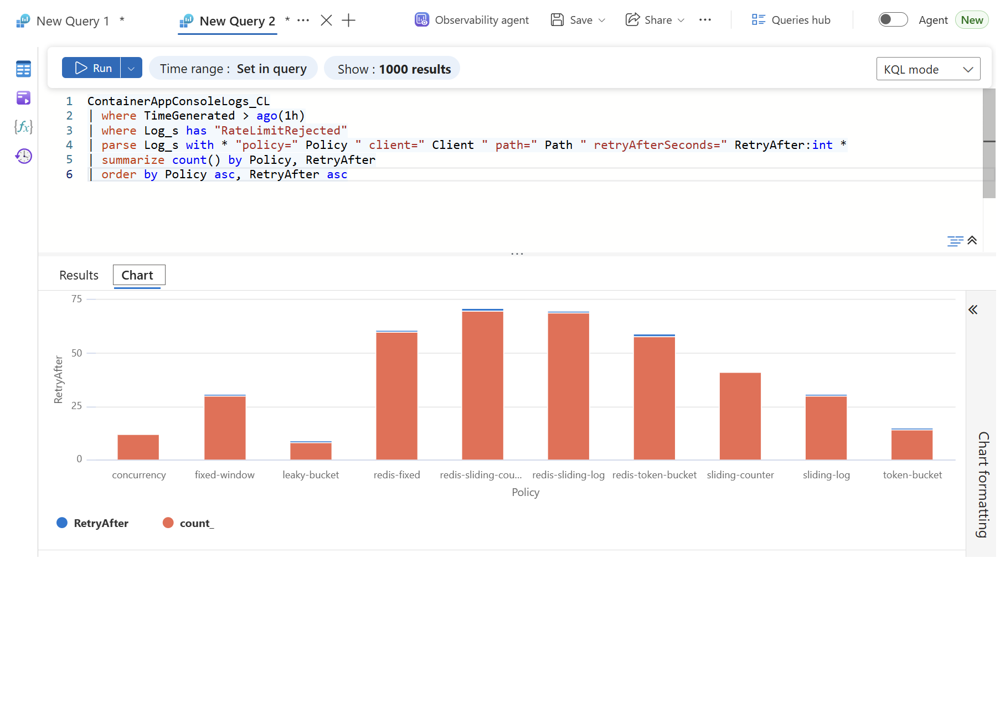

# KQL for the rate limiting sample

Rejections and saturation are different signals. A rising 429 count says a client is over its budget. A limiter pinned at its permit limit says the system is at capacity. These queries keep them apart, and answer the question the load test raised: when a 429 comes back, which layer produced it?

Three tables, all in the Log Analytics workspace the Bicep creates:

| Table | Comes from | Needs |
|---|---|---|
| `ApiManagementGatewayLogs` | APIM diagnostic setting (`infra/modules/apim.bicep`) | nothing extra |
| `ContainerAppConsoleLogs_CL` | the API's stdout; `OnRejected` writes one `RateLimitRejected` line per 429. Columns: `Log_s`, `RevisionName_s`, `ContainerGroupName_s` (the replica) | nothing extra |
| `customMetrics` (Application Insights) | .NET's built-in `aspnetcore.rate_limiting.*` meters | OpenTelemetry + Azure Monitor exporter, see the end |

Logs arrive with a delay of a few minutes. Run the load test, wait, then query.

## 1. Who rejected it: gateway or service?

The single most useful query. `BackendResponseCode` is empty when APIM answered without calling the backend (its own `rate-limit-by-key` or `limit-concurrency` fired). When it equals 429, the service said no and APIM passed it through.

```kql
ApiManagementGatewayLogs
| where TimeGenerated > ago(1h)
| where ResponseCode == 429
| extend RejectedBy = case(
    isempty(BackendResponseCode) or BackendResponseCode == 0, "gateway",
    BackendResponseCode == 429, "service",
    "other")
| summarize Rejections = count() by RejectedBy, bin(TimeGenerated, 1m)
| render timechart
```

In the sample run every 429 was `service`: the gateway's `increment-condition` excludes responses of 400 and above, so service-layer rejections never consumed gateway budget.

If the diagnostic setting was created without `logAnalyticsDestinationType: 'Dedicated'` (check with `az monitor diagnostic-settings list`; the column reads `AzureDiagnostics`), the rows are in the legacy `AzureDiagnostics` table with suffixed, lower-camel column names instead. Same query, different spelling:

```kql
AzureDiagnostics
| where TimeGenerated > ago(1h)
| where ResourceProvider == "MICROSOFT.APIMANAGEMENT" and Category == "GatewayLogs"
| where responseCode_d == 429
| extend RejectedBy = case(
    isempty(backendResponseCode_d) or backendResponseCode_d == 0, "gateway",
    backendResponseCode_d == 429, "service",
    "other")
| summarize Rejections = count() by RejectedBy, bin(TimeGenerated, 1m)
| render timechart
```

The other gateway queries translate the same way: `TotalTime` becomes `totalTime_d`, `BackendTime` becomes `backendTime_d`, `ApimSubscriptionId` becomes `apimSubscriptionId_s`, `Url` becomes `url_s`. The Bicep in this repo sets `Dedicated`, so a fresh deploy gets the typed table.

## 2. Rejections per client and endpoint

Which subscription is over budget, and on which algorithm. `ApimSubscriptionId` is the partition key the service also uses (via `X-Client-Id`), so this lines up with the service-side view below.

```kql
ApiManagementGatewayLogs
| where TimeGenerated > ago(1h)
| summarize
    Requests = count(),
    Rejected = countif(ResponseCode == 429),
    RejectRate = round(100.0 * countif(ResponseCode == 429) / count(), 1)
  by ApimSubscriptionId, Url = tostring(parse_url(Url).Path)
| order by Rejected desc
```

## 3. What the gateway costs

`TotalTime` is APIM's end-to-end time, `BackendTime` the call to Container Apps. The difference is what the gateway hop adds. The load test measured 2 to 5 ms at p50 from the client side; this is the same number from the inside.

```kql
ApiManagementGatewayLogs
| where TimeGenerated > ago(1h)
| where isnotempty(BackendTime)
| extend GatewayOverheadMs = TotalTime - BackendTime
| summarize
    p50 = percentile(GatewayOverheadMs, 50),
    p95 = percentile(GatewayOverheadMs, 95),
    p99 = percentile(GatewayOverheadMs, 99),
    Requests = count()
  by bin(TimeGenerated, 5m)
| render timechart
```

## 4. Service-side rejections per policy

The API writes `RateLimitRejected policy=... client=... path=... retryAfterSeconds=...` on every 429. Container Apps ships stdout to `ContainerAppConsoleLogs_CL`.

```kql
ContainerAppConsoleLogs_CL
| where TimeGenerated > ago(1h)
| where Log_s has "RateLimitRejected"
| parse Log_s with * "policy=" Policy " client=" Client " path=" Path " retryAfterSeconds=" RetryAfter:int *
| summarize Rejections = count() by Policy, bin(TimeGenerated, 1m)
| render timechart
```

## 5. The two-replica problem, visible

Group the same rejections by replica. Two replicas, each with its own in-process counter, each rejecting roughly half as often as one would: that is the doubling from `load-test-results-azure.md`. The `redis-*` policies show the same rejection counts regardless of how many replicas serve them.

```kql
ContainerAppConsoleLogs_CL
| where TimeGenerated > ago(1h)
| where Log_s has "RateLimitRejected"
| parse Log_s with * "policy=" Policy " client=" Client " path=" Path " retryAfterSeconds=" RetryAfter:int *
| summarize Rejections = count() by Policy, Replica = ContainerGroupName_s
| evaluate pivot(Replica, sum(Rejections), Policy)
```

Observed after the through-APIM run of 2026-09-16 (`load-test-results-apim.md`):


The chart is the Logs blade's own stacked-column rendering of the pivot; the table below is the same data.

| Policy | Replica 8ww5d | Replica h4... | Total rejected |
|---|---|---|---|
| fixed-window | 15 | 15 | 30 |
| sliding-log | 15 | 15 | 30 |
| sliding-counter | 22 | 19 | 41 |
| token-bucket | 7 | 7 | 14 |
| leaky-bucket | 5 | 3 | 8 |
| concurrency | 5 | 7 | 12 |
| redis-sliding-log | 31 | 38 | 69 |
| redis-sliding-counter | 42 | 28 | 70 |
| redis-token-bucket | 26 | 32 | 58 |
| redis-fixed-window | 30 | 30 | 60 |

Same client, same 90 requests per policy. The in-process rows total about 30 rejections because each replica rejected about half of what one instance would, so twice the configured traffic got through. The Redis rows total about 60 (plus the scenario 1 rejections), because one shared counter saw everything. The uneven Redis columns show the load balancer split traffic unevenly and it made no difference to the decision.

## 6. Retry-After hygiene

What are you telling clients to do? A limiter that always says `Retry-After: 1` on a 60 s window is lying to them. This shows the distribution per policy.

```kql
ContainerAppConsoleLogs_CL
| where TimeGenerated > ago(1h)
| where Log_s has "RateLimitRejected"
| parse Log_s with * "policy=" Policy " client=" Client " path=" Path " retryAfterSeconds=" RetryAfter:int *
| summarize count() by Policy, RetryAfter
| order by Policy asc, RetryAfter asc
```

Observed: one row per policy, all with `RetryAfter = 1`. Correct for a one-second window with whole-second rounding, and not very informative at these settings; the query earns its place at a 60-second window.



## 7. Clients that ignore Retry-After

A client that gets a 429 and comes back inside the advertised wait is the load generator the post warns about. Gateway logs, per subscription: gap between consecutive requests after a 429.

```kql
ApiManagementGatewayLogs
| where TimeGenerated > ago(1h)
| order by ApimSubscriptionId asc, TimeGenerated asc
| serialize
| extend PrevCode = prev(ResponseCode), PrevTime = prev(TimeGenerated), PrevSub = prev(ApimSubscriptionId)
| where PrevSub == ApimSubscriptionId and PrevCode == 429
| extend GapMs = datetime_diff('millisecond', TimeGenerated, PrevTime)
| summarize
    RetriesAfter429 = count(),
    RetriedWithin1s = countif(GapMs < 1000),
    MedianGapMs = percentile(GapMs, 50)
  by ApimSubscriptionId
```

The load test itself scores badly here on purpose: it never waits.

## 8. Saturation, not rejection (needs Application Insights)

None of the above says whether the concurrency limiter is pinned at its permit limit or how long requests sit in the leaky bucket queue. .NET 8 exposes that as metrics on the `Microsoft.AspNetCore.RateLimiting` meter: `aspnetcore.rate_limiting.active_request_leases`, `aspnetcore.rate_limiting.queued_requests`, `aspnetcore.rate_limiting.request.time_in_queue`, `aspnetcore.rate_limiting.request_lease.duration` and `aspnetcore.rate_limiting.requests` (tagged with `aspnetcore.rate_limiting.policy` and `aspnetcore.rate_limiting.result`).

To get them into Log Analytics, add Application Insights and the Azure Monitor OpenTelemetry distro (`Azure.Monitor.OpenTelemetry.AspNetCore`) with `builder.Services.AddOpenTelemetry().UseAzureMonitor()` and the meter added to `WithMetrics(m => m.AddMeter("Microsoft.AspNetCore.RateLimiting"))`. Then:

```kql
customMetrics
| where TimeGenerated > ago(1h)
| where name == "aspnetcore.rate_limiting.active_request_leases"
| extend Policy = tostring(customDimensions["aspnetcore.rate_limiting.policy"])
| summarize MaxInFlight = max(valueMax) by Policy, bin(TimeGenerated, 1m)
| render timechart
```

A `concurrency` line flat at 4 while requests keep arriving is saturation; the 429 count tells you how much demand you are turning away, this tells you the limiter is the thing doing it. That pairing is the "watch both" the post asks for. It is left as an extension of the sample rather than deployed, because it adds a resource and a package for a signal the load test does not need.
